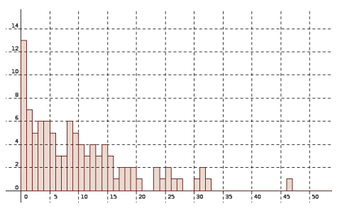

$T =$variable aléatoire donnant la durée de vie d'un atome.

# 1 Point de vue probabiliste

**Modèle de désintégration = durée de vie sans vieillissement** :

*La probabilité qu'un atome soit « vivant » à l'intant $t + h$ sachant qu'il 
est « vivant » à l'instant $t$ ne dépend pas de $t$ (quel que soit $h$) :*

$$ P_{(T > t)} (T > t + h) = P (T > t) $$

On en tire que1em: $P (T > t + h) = P (T > t) \times P (T > h)$ 
pour tout $t, h$

La fonction $G (x) = P (T > x)$ vérifie donc la propriété : $G (x + y) = G 
(x) \times G (y)$ pour $x, y \geqslant 0$

Alors on peut alors démontrer qu'une telle fonction est une exponentielle. 
Plus précisément, il existe un réel $\lambda > 0$ ($> 0$ car une 
probabilité $\in [0 ; 1]$) tel que $G (x) = e^{\- \lambda x}$.

On a donc $P (T > t) = e^{\- \lambda t} \Longleftrightarrow P (T \leqslant 
t) = 1 - e^{- \lambda t}$.

Ce sont les formules de calcul des probabilités d'une loi exponentielle à 
densité $f (t) = \lambda e^{\- \lambda t}$.

La valeur moyenne dans une loi exponentielle est $\dfrac{1}{\lambda}$. C'est 
donc la durée moyenne de vie d'**un** **atome** avec ce modèle.

# 2 Point de vue statistique

[voir une explication](https://www.cea.fr/comprendre/Pages/radioactivite/radioactivite.aspx?Type=Chapitre&numero=1)

En statistique, on réfléchit sur un échantillon.

Si on appelle $N (t)$ le nombre d'atomes vivants à l'instant $t$, on doit 
plutôt considérer ce nombre comme une moyenne, la moyenne de $N\_{0}$ 
variables aléatoires dont chacune vaut 1 si l'atome est vivant et 0 sinon (=la 
valeur moyenne d'une variable suivant une loi binômiale).

Il faut d'abord préciser le modèle précédent  :

* chaque atome se désintègre sans vieillissement
* les atomes ne s'influencent pas et au départ, on en a $N\_{0}$.

A l'instant $t$, chaque atome a une probabilité $P (T > t) = e^{\- \lambda 
t}$ d'ếtre vivant. Comme on en a $N\_{0}$, le nombre de survivants sera 
en moyenne $N\_{0} e^{\- \lambda t}$. (loi binomiale : nombre répétitions 
× proba succès))

En gros, on peut considérer $\dfrac{N (t)}{N\_{0}}$ comme la proportion de 
survivants à l'instant $t$ et elle vaut  $P (T > t) = e^{\- \lambda t}$.

$$
\sqrt{x^2+1}\neq x+1
$$

Et une insertion en ligne donnera : $\sqrt{x^2+1}\neq x+1$

Expérimentalement, on va seulement observer un échantillon d'atomes qui 
donnera des valeurs expérimentales $\hat{N} (t)$ « proches » de $N (t)$.

On mesure les durées de vie d'atomes dans un échantillon et on place les 
résultats dans un histogramme : (en ordonnées: %tage de survivants à l'instant 
$t$)

Sur un échantillon, on voit que les sommets des barres semblent suivre une 
fonction cste × exponentielle (en fait la densité). En effet, $\hat{N} 
(t) \approx N (t) = N_{0} e^{\- \lambda t}$

|  1 atome |  2 atome  | 3 atomes  | 4 atomes | etc ..  |
|--:|---|---|---|---|
|  2 | 4  | 8  | 9  |1   |
| $f$  |   |   |   |   |
|  $f$ |   |   |   |   |

# 3 Point de vue différentiel

La vitesse instantannée de désintégration est :

\[ \displaystyle \lim_{h \longrightarrow 0} \dfrac{N (t) \- N (t + h)}{h} = N' (t) \]

où $N (t)$ est la variable aléatoire donnant le nombre moyen d'atomes vivants 
à l'instant $t$ .

Expérimentalement, en estimant $N (t)$ et $N (t + h)$ sur un échantillon (on 
devrait dire : $\hat{N} (t) $et $\hat{N} (t + h)$), on doit pouvoir observer 
que cette vitesse est une constante × exponentielle ce qui veut dire que 
$\dfrac{N' (t)}{N (t)}$ semble être une constante indépendante de t.

Or $\dfrac{N' (t)}{N (t)} = \dfrac{\dfrac{N' (t)}{N\_{0}}}{\dfrac{N 
(t)}{N\_{0}}} = \- \dfrac{{\lim \_{h \longrightarrow 0}}\_{} P (t < T 
< t + h)}{P (t > h)} = \lim \_{t \longrightarrow 0} \- \dfrac{P (t 
< T < t + h)}{P (T > h)} =  \- \lim \_{h \longrightarrow 0} 
P\_{(T > h)} (t < T < t + h)$

On appelle λ cette constante$ \lim \_{h \longrightarrow 0} P\_{(T > 
t)} (t < T < t + h)$; on l'interpèrete comme :

* le taux de défaillance instantannée à l'instant $t$ (c'est l'interprétation 
  de $\- \dfrac{N' (t)}{N (t)}$)
* la probabilité qu'à un instant $t$ un vivant se désintègre.

On a donc : N'(t)N(t)$= \- \lambda$ et donc $N (t) = C e^{\- \lambda t}$ et 
finalement : $N (t) = N\_{0} e^{\- \lambda t}$ c'est-à-dire $\dfrac{N 
(t)}{N\_{0}} = e^{\- \lambda t}$

Comme vu plus haut : $\dfrac{N (t)}{N\_{0}} = P (T > t)$ donc $P (T > 
t) = e^{\- \lambda t}$ et on retombe sur les formules de la loi 
exponentielle[^1].

[^1]: On peut démontrer qu'un objet qui subit un taux de défaillance constant $\lambda$ a une durée de vie vérifiant la loi exponentielle de paramètre $\lambda$ .
